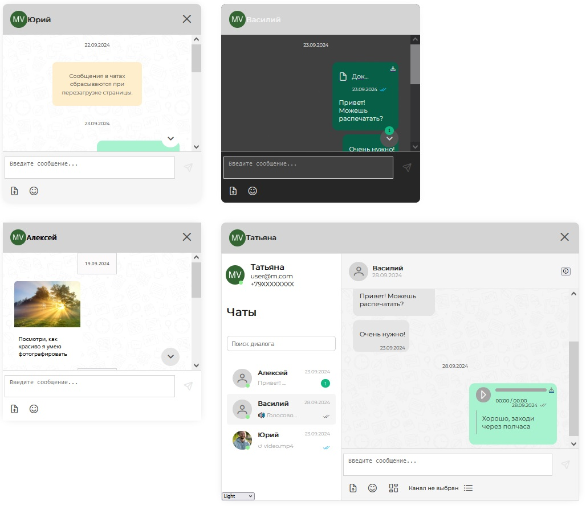

# Demo chat app 

This app contains 4 linked chat windows, providing dialogs between 4 people. Includes feed message, chat list, type field. Supports most commonly used chat features: read/write messages, upload/download files and others.

## Dependencies:
- Vue
- Vite
- Pinia
- [mobilon-dev/chotto](https://github.com/mobilon-dev/chotto) library

## Screenshot

## Github pages

[chat app demo](https://determaer.github.io/chat-demo/)

## Local deployment

After cloning repo to local machine type this in CLI:

` npm install `

` npm run dev `
