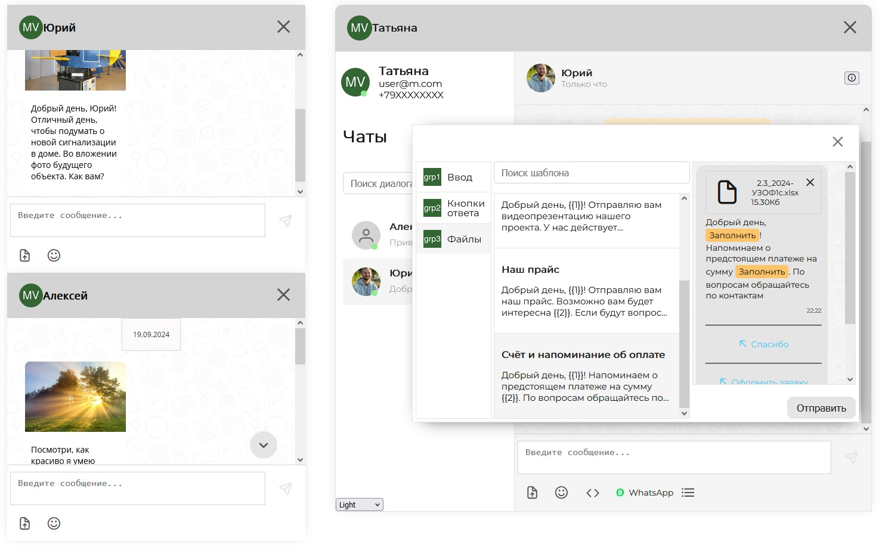

# Demo chat app 

This app contains 4 chat windows (3 of them are configured on feed layout, 1 of them - base layout, including chat list and feed). Supports most commonly used chat features: read, write, upload files, Based on [mobilon-dev/chotto](https://github.com/mobilon-dev/chotto) library.

# Github pages

[chat app demo](https://determaer.github.io/chat-demo/)

# Local deployment

After cloning repo to local machine type this in CLI:

` npm install `

` npm run dev `